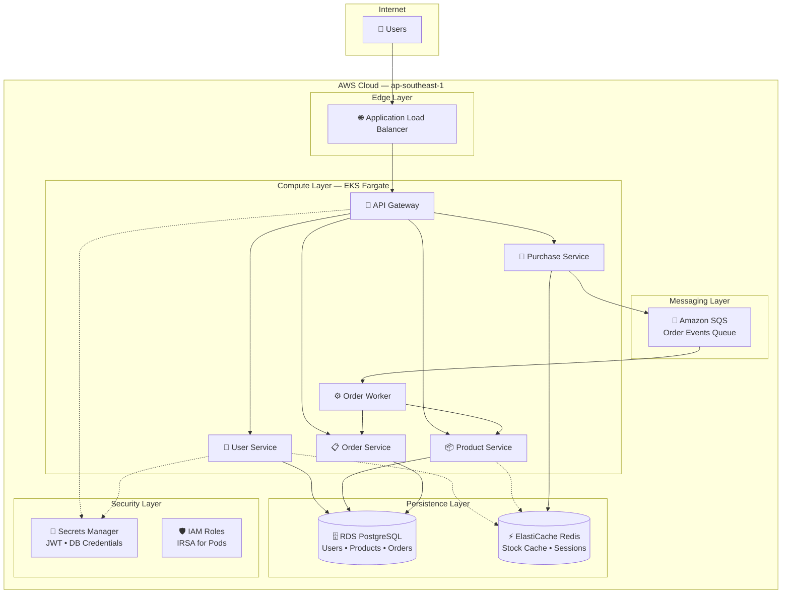
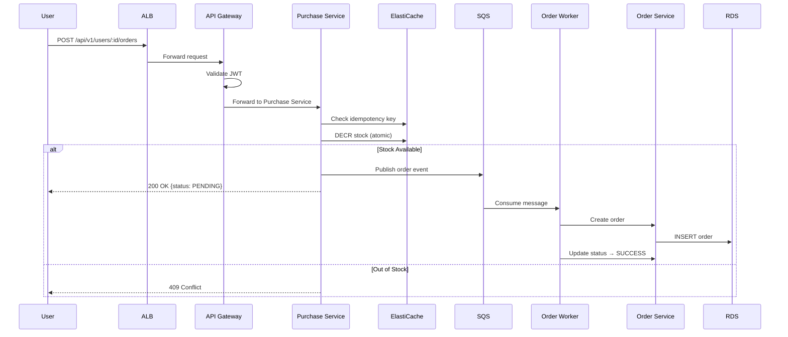

# Flash Sale Engine

Cloud-native flash sale system built on AWS. Designed to handle thousands of concurrent purchases using distributed caching, event-driven messaging, and serverless container orchestration.

## Cloud Architecture



## AWS Services

| Layer | Service | Purpose |
|-------|---------|---------|
| **Edge** | Application Load Balancer | HTTPS termination, request routing |
| **Compute** | EKS + Fargate | Serverless container orchestration |
| **Cache** | ElastiCache Redis | Atomic stock operations, session cache |
| **Database** | RDS PostgreSQL | Persistent storage for users, products, orders |
| **Messaging** | Amazon SQS | Async order processing queue |
| **Secrets** | Secrets Manager | Secure credential storage |
| **Auth** | IAM (IRSA) | Pod-level AWS permissions |

## Service Mesh

| Service | Port | Responsibility |
|---------|------|----------------|
| API Gateway | 8080 | JWT validation, rate limiting, request routing |
| User Service | 8082 | Authentication, user management |
| Product Service | 8083 | Product catalog, stock management |
| Order Service | 8084 | Order persistence, status tracking |
| Purchase Service | 8081 | High-speed purchase processing |
| Order Worker | — | Async order fulfillment from SQS |

## Purchase Flow



## Infrastructure as Code

```
terraform/
├── main.tf          # EKS, RDS, ElastiCache, SQS, IAM
├── variables.tf     # Configuration parameters
├── outputs.tf       # Connection strings, ARNs
└── terraform.tfvars # Environment-specific values (gitignored)
```

Deploy with:
```bash
cd terraform && terraform init && terraform apply
```

Full deployment guide: [docs/DEPLOYMENT.md](docs/DEPLOYMENT.md)

---

## Local Development

```bash
cd flashsale
cp .env.example .env
docker-compose up --build

# Seed database
cd scripts && go run seed.go

# Test
curl http://localhost:8080/health
```

---

## API Reference

Base URL: `http://<ALB_DNS>/api/v1`

### Authentication

| Method | Endpoint | Description |
|--------|----------|-------------|
| POST | `/auth/signup` | Register user |
| POST | `/auth/login` | Get JWT token |

### Products

| Method | Endpoint | Description |
|--------|----------|-------------|
| GET | `/products` | List products |
| GET | `/products/:id` | Get product |
| GET | `/products/:id/stock` | Get stock |

### Orders (Auth Required)

| Method | Endpoint | Description |
|--------|----------|-------------|
| POST | `/users/:id/orders` | Create order |
| GET | `/users/:id/orders` | List orders |
| GET | `/users/:id/orders/:oid` | Get order |
| DELETE | `/users/:id/orders/:oid` | Cancel order |

---

## Test Cases

### Setup
```powershell
$API = "http://localhost:8080"  # or ALB URL
```

### 1. Sign Up
```powershell
curl.exe -X POST "$API/api/v1/auth/signup" `
  -H "Content-Type: application/json" `
  -d '{"email":"tester@example.com","password":"password123"}'
```

**Expected Response:**
```json
{
  "success": true,
  "data": {
    "user_id": "550e8400-e29b-41d4-a716-446655440000"
  },
  "message": "Account created successfully. You can now log in."
}
```

### 2. Login
```powershell
$res = curl.exe -s -X POST "$API/api/v1/auth/login" `
  -H "Content-Type: application/json" `
  -d '{"email":"tester@example.com","password":"password123"}' | ConvertFrom-Json
$TOKEN = $res.data.token
$USER_ID = $res.data.user_id
```

**Expected Response:**
```json
{
  "success": true,
  "data": {
    "token": "eyJhbGciOiJIUzI1NiIs...",
    "expires_in": 86400,
    "user_id": "550e8400-e29b-41d4-a716-446655440000",
    "email": "tester@example.com",
    "role": "user"
  },
  "message": "Login successful. Welcome back!"
}
```

### 3. List Products
```powershell
$res = curl.exe -s "$API/api/v1/products" | ConvertFrom-Json
$PRODUCT_ID = $res.data.products[0].id
```

**Expected Response:**
```json
{
  "data": {
    "products": [
      {
        "id": "9b633b6b-4384-42ea-9675-2c3788f8e4bc",
        "name": "iPhone 15 Pro",
        "description": "Latest flagship smartphone...",
        "price": 999,
        "stock": 100
      }
    ]
  }
}
```

### 4. Create Order
```powershell
curl.exe -X POST "$API/api/v1/users/$USER_ID/orders" `
  -H "Authorization: Bearer $TOKEN" `
  -H "Content-Type: application/json" `
  -d "{`"product_id`":`"$PRODUCT_ID`",`"qty`":1}"
```

**Expected Response:**
```json
{
  "success": true,
  "data": {
    "order_id": "e4858bd8-5542-4d54-9fe1-de5ce07be721",
    "product_id": "9b633b6b-4384-42ea-9675-2c3788f8e4bc",
    "product_name": "iPhone 15 Pro",
    "qty": 1,
    "status": "PENDING"
  },
  "message": "Your order for iPhone 15 Pro has been placed and is being processed."
}
```

### 5. Check Order Status
```powershell
curl.exe -s "$API/api/v1/users/$USER_ID/orders/$ORDER_ID" `
  -H "Authorization: Bearer $TOKEN"
```

**Expected Response:**
```json
{
  "success": true,
  "data": {
    "order_id": "e4858bd8-5542-4d54-9fe1-de5ce07be721",
    "status": "SUCCESS"
  },
  "message": "Order retrieved successfully."
}
```

---

## Failure Test Cases

### Duplicate Purchase
```powershell
# Same product within 2 minutes
curl.exe -X POST "$API/api/v1/users/$USER_ID/orders" `
  -H "Authorization: Bearer $TOKEN" `
  -H "Content-Type: application/json" `
  -d '{"product_id":"...","qty":1}'
```

**Expected Response:**
```json
{
  "success": false,
  "data": { "product_id": "9b633b6b-4384-42ea-9675-2c3788f8e4bc" },
  "message": "You already have a pending order for iPhone 15 Pro. Please wait for it to complete.",
  "error": "DUPLICATE_PURCHASE"
}
```

### Out of Stock
```powershell
curl.exe -X POST "$API/api/v1/users/$USER_ID/orders" `
  -H "Authorization: Bearer $TOKEN" `
  -H "Content-Type: application/json" `
  -d '{"product_id":"...","qty":9999}'
```

**Expected Response:**
```json
{
  "success": false,
  "data": { "product_id": "9b633b6b-4384-42ea-9675-2c3788f8e4bc" },
  "message": "Sorry, iPhone 15 Pro is currently out of stock.",
  "error": "OUT_OF_STOCK"
}
```

### Unauthorized Access
```powershell
curl.exe -X POST "$API/api/v1/users/$USER_ID/orders" `
  -H "Content-Type: application/json" `
  -d '{"product_id":"...","qty":1}'
```

**Expected Response:**
```json
{
  "success": false,
  "data": null,
  "message": "You need to be logged in to access this resource.",
  "error": "MISSING_AUTH_HEADER"
}
```

### Invalid Credentials
```powershell
curl.exe -X POST "$API/api/v1/auth/login" `
  -H "Content-Type: application/json" `
  -d '{"email":"tester@example.com","password":"wrongpassword"}'
```

**Expected Response:**
```json
{
  "success": false,
  "data": null,
  "message": "Invalid email or password. Please try again.",
  "error": "INVALID_CREDENTIALS"
}
```

### Rate Limiting
```powershell
# 120+ requests per minute
for ($i=1; $i -le 150; $i++) { curl.exe -s "$API/api/v1/products" }
```

**Expected Response:**
```json
{
  "error": "Too many requests. Please try again later.",
  "message": "Rate limit exceeded"
}

---

## Cost Estimate

| Duration | Cost |
|----------|------|
| 1 day | ~$5 |
| 3 days | ~$15 |
| 1 week | ~$30 |

**Remember:** Run `terraform destroy` when done.

---

## License

MIT
